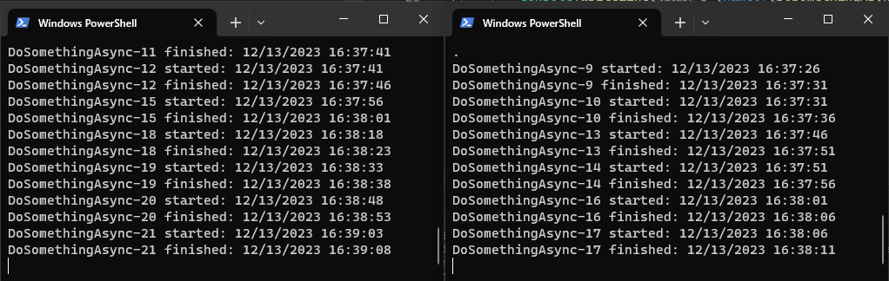

# AspNetCoreHangfireDemo

## Introduction

This demo illustrates how to execute a `recurring job` using `Hangfire` with `Mongo` at regular intervals. Additionally, it showcases how to `trigger` an immediate execution, `preventing multiple instances of the same job from running simultaneously` across `multiple server instances`.



## Prerequisites

Ensure that Mongo is running locally with the same configuration as specified in the appsettings.json file. Modify the file accordingly or run Mongo using the following parameters:

```bash
docker run --restart always -d -p 27017:27017 -h $env:COMPUTERNAME --name mongo mongo:4.2.8 --replSet=EtnReplicaSet ; Start-Sleep -Seconds 1 ; docker exec mongo mongo --eval "rs.initiate();"
```

## How to test

Navigate to the /Api folder, open the current directory in two or more separate consoles, and execute the following commands in each one (ensure different ports are used for each instance):

```bash
dotnet run --urls=http://localhost:5001/
```

```bash
dotnet run --urls=http://localhost:5002/
```

After running these commands, access the `/Jobs` endpoint on any of the active servers. The `DoSomething` job should execute without overlapping with another instance of the same job.
